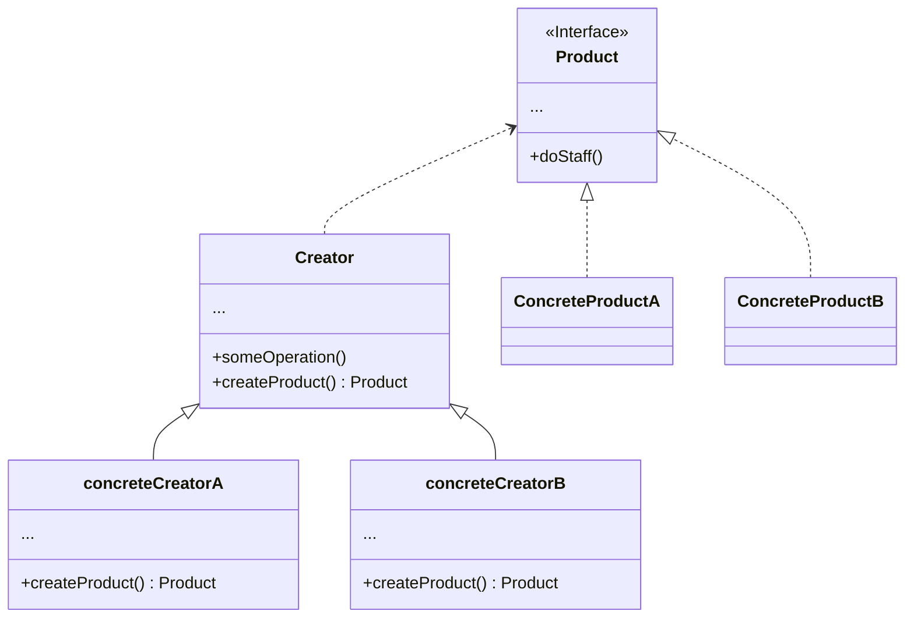

# Factory Method

## 概要

Factory Methodは、生成に関するデザインパターンの１つ。  
スーパークラスでオブジェクトを作成するためのインターフェースが決まっているが、  
サブクラスでは作成されるオブジェクトの型を変更することができる。  

## 前提問題

物流管理アプリケーションを作成することを考える。  

アプリの最初のバージョンは、陸上のトラック輸送のみを処理できる。  
コードの大部分は`Truck`クラス内に存在する。

しばらくして、アプリに海上物流を組み込んでほしいという要望があがったとする。  
コードのほとんどは`Truck`クラスに結合されており、  
アプリに`Ship`を追加するにはコードの大部分に手を加える必要がある。

さらに後でアプリに別の輸送手段を追加することにした場合、  
この変更作業すべてを再度行うことになる。
結果として、運輸オブジェクトのクラスに応じてアプリの動作を切り替える条件文だらけの厄介なコードができあがってしまう。

## 解決策

Factory Method パターンに従うと、  
オブジェクトのインスタンスを直接作成するのではなく、  
特別な`Factory Method`への呼び出しで置き換える。  
Factory Methodから返されるオブジェクトは、プロダクトと呼ばれる。

これらのプロダクトに共通のベースクラスまたはインターフェースがある場合にのみ、  
サブクラスは異なる型のプロダクトを返すことができる。  

また、ベースクラス内のFactory Methodの戻り値の型は、このインターフェースとして宣言されている必要がある。

Factory Methodを使用するコード（クライアントコード）からは、  
実際の個々のプロダクトの間に違いは見られない。  
クライアントは全ての製品を抽象的な`Transport`として扱う。  
クライアントは全ての`Transport`が`deliver`メソッドを持っていることは知っているが、それが厳密にどのように振る舞うかは重要なことではない

## 構造

## 適応性

- **コードが機能する対象のオブジェクトの正確な型と依存関係が前もってわからない場合。**
  - Factory Methodでは、プロダクト作成のコードを実際にプロダクトを使用するコードから分離する。
  - プロダクト作成のコードの拡張が残りのコードから独立して簡単に行える。
- **自分の書いたライブラリやフレームワークのユーザーに内部のコンポーネントを拡張する方法を提供したい場合。**
- **毎回再構築する代わりに、既存オブジェクトを再利用してシステム資源を節約したい場合**

## 実装方法

### 1. すべてのプロダクトが同じインターフェースに従うようにする

このインターフェースでは、すべてのプロダクトにとって意味のあるメソッドを宣言する必要がある。

### 2. クリエイタークラス内に空のファクトリーメソッドを追加する

メソッドの戻り値の型は、共通のプロダクトインターフェースと一致する必要がある

### 3. クリエイターのコード内で、プロダクトのコンストラクターの参照を全部探し出す

プロダクト作成コードをファクトリーメソッドに抽出しながら、１つずつコンストラクター呼び出しをファクトリーメソッドへの呼び出しで置き換える。
ファクトリーメソッドに、 プロダクトの戻り値の型を決めるためのパラメーターを一時的に追加する必要があるかもしれない。
この時点ではどのプロダクトのクラスをインスタンス化するかを選択する巨大な`Switch`文の塊になっているかもしれないが、この後修正するので問題ない。

### 4. ファクトリーメソッドに並んでいるプロダクトの型ごとにクリエーターのサブクラスを作成する

基底クラスのファクトリーメソッドの構築コードの該当部分を抽出して、  
それでサブクラスのファクトリーメソッドを上書きする。

### 5. プロダクトの型が多すぎる場合

全ての型に応じたサブクラスを作成することが現実的でない場合は、  
基底クラスに追加した制御パラメーターを再利用できる。

例）基底クラス：Mail
サブクラス：AirMail、GroundMail、Transport
オブジェクト：Plane、Truck、Train

AirMailクラスはPlaneオブジェクトのみを使用するが、  
GroundMailクラスはTruckとTrain両方のオブジェクトを扱うことができる。

クライアントコードがGroundMailクラスのファクトリーメソッドを引数として渡し、
どちらのプロダクトを受け取りたいか伝えるようにする。

### 6. すべての抽出作業の後、基底クラスのファクトリーメソッドが空になった場合  

そのクラスを抽象クラスとすることができる。  
何か残った場合は、それをメソッドのデフォルト動作とすることができる。

## 長所と短所

### 長所

- クリエーターと具象プロダクトとの密な結合を回避
- 単一責任の原則　プロダクト作成コードがプログラム中の１箇所にまとめられ、保守が容易
- 開放閉鎖の原則　プロダクトの新しい型をプログラムに導入しても、既存のクライアントコードの機能に影響しない

### 短所

- 多数の新規サブクラス導入の必要があり、コードが複雑化する

## 他のパターンとの関係

- 多くの設計は、比較的単純でサブクラスによりカスタマイズ可能な Factory Method から始まる
  - もっと複雑だが柔軟な Abstract Factory や Prototype や Builder に発展していく
- Abstract Factory クラスは、多くの場合 Factory Method の集まり
- Factory Method は Template Method の特別な場合である
  - 同時に Factory Method は、大きな Template Method の１つのステップとしても使える。

## （参考）

1. 上位モジュールはいかなるものも下位モジュールから持ち込んではならない。双方とも抽象（例としてインターフェース）に依存するべきである。
2. 抽象は詳細に依存してはならない。詳細（具象的な実装内容）が抽象に依存するべきである。

この二点の背景にある考えとは、
「上位モジュールと下位モジュールの相互作用を設計する際は、その相互作用自体も抽象的に考える必要がある」ということである。

上位モジュールの抽象化だけではなく、それを詳細化する下位モジュールへの見方も変えて、インターフェースの使い方も変えることを求めている。
多くの場合、相互作用を抽象的に捉えることは、追加のコーディングパターンを増やすことなくコンポーネント間の結合を減らせることに繋がる。
これはより軽量で小規模な実装依存性相互作用スキーマを実現する。

### 依存性逆転の原則に違反してないかの指針

- 具象クラスへの参照を持つ変数を持たない
- 具象クラスからクラスを継承しない
- 規定クラスの実装済みのメソッドをオーバーライドしない

※場合によってはシンプル性を優先し下位モジュールへの依存を許容した方が良い
